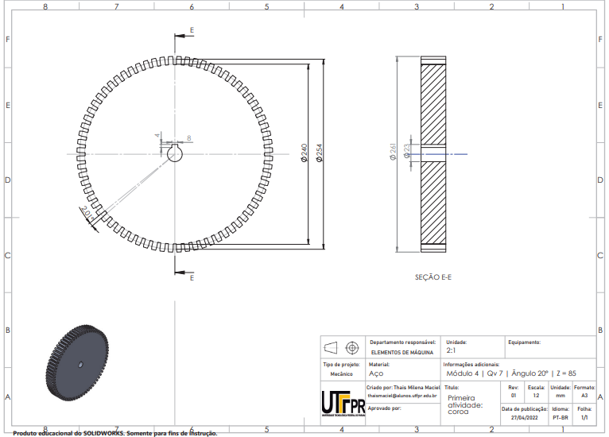
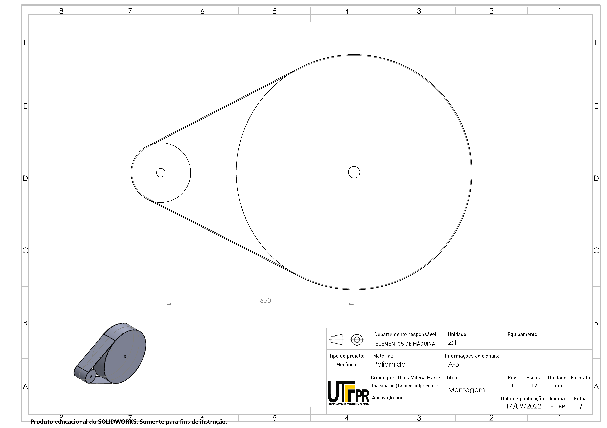

# Elementos de máquinas

A biografia utilizada foi:  
NORTON, Rob. Projeto de máquinas: uma abordagem integrada. 2. ed. Porto Alegre, RS: Bookman, 2004. xiii, 931 p. + 1 CD-ROM 4 ¾ pol. ISBN 8536302739.  
SHIGLEY, Joseph Edward; MISCHKE, Charles R.; BUDYNAS, Richard G. Projeto de engenharia mecânica. 7. ed. Porto Alegre: Bookman, 2005. 960 p. ISBN 85-363-0562-2.   

Premissas de Projeto
1- Vida útil: 20 anos, sistema operará 16 horas/dia, 5 dias/semana.
2- Aplicação: Ambiente industrial;
3- Temperatura de trabalho: Temperatura ambiente;
4- Deve ter boa eficiência mecânica;
5- Deve ser compacto;

  ### <b>Atividade 1</b> #####

O eixo de entrada de um compressor será acionado por um redutor com engrenagens. Será utilizado um acoplamento elástico para acoplar o eixo de saída do redutor com o eixo de entrada do equipamento. O equipamento operará a 72 rpm e necessitará da potência defina na tabela abaixo, de maneira continua, no seu eixo de saída. O projeto exige que o redutor transmita a potência entre dois eixos paralelos e seja alimentado por um motor elétrico de indução trifásico. Determinar os seguintes itens: 
a) Definir um motor elétrico apropriado que deverá alimentar o redutor de velocidade; 
b) Fazer croqui (à mão livre) do sistema de transmissão de potência por meio de engrenagens de dentes retos mostrando o trem de engrenagem proposto; 
 
c) Relações de transmissão de todo o trem de engrenagens; 
d) Principais dimensões geométricas do par de engrenagens que fornece o torque de saída; 
e) Cálculo das tensões de fadiga de flexão e desgaste superficial nas 1,5 engrenagens do item d;
f) Dimensionamento das engrenagens para um fator de segurança 1,5; 
g) Fazer o modelamento 3D e 2D (vistas ortogonais em folha com legenda) com a disposição das engrenagens. 
 

  ### <b>Atividade 2</b> #####

Escolha um elemento de transmissão flexível (polia/correia ou corrente de rolos) e o dimensione considerando um fator de segurança igual a 1,8, de forma a atender as mesmas condições (rotação, torque etc.) do último par de engrenagens da atividade 1. Entregar os desenhos técnicos de conjunto (mostrando a disposição do sistema escolhido) e detalhados (desenhos para fabricação). 
 
 
 

  ### <b>Atividade 3</b> #####

1 - Fazer croqui da forma construtiva dos 3 eixos do redutor (Esboço do arranjo
geral do eixo, incluindo meios de localizar as engrenagens, mancais e/ou outros
elementos de fixação para transmitir o torque); 
2 - Determinar os seguintes itens para o eixo de saída da atividade 1: 
a) Estimar as dimensões de comprimento, posicionar os carregamentos sobre o
eixo (diagrama de corpo livre); 
b) Calcular as forças provocadas pela engrenagem; 
c) Calcular os diagramas de momentos fletores, forças cortantes e torque; 
d) Escolher material e calcular a tensão limite de fadiga corrigida do eixo. 
e) Estimar a concentração de tensão nos pontos críticos do eixo; 
f) Calcular o momento fletor e torque atuantes nestes pontos críticos; 
g) Calcular os diâmetros mínimos, nos pontos críticos, considerando um fator de
segurança (FS) 1,8 conforme critério Elíptico da ASME; 
h) Adequar os diâmetros calculados ao projeto do eixo; 
i) Recalcular a concentração de tensão para os diâmetros utilizados e
otimizar o projeto do eixo (reduzir ou aumentar os diâmetros para
atender FS = 1,8). 
j) Calcular as deflexões do eixo (por flexão e torção) e as 3 primeiras
frequências naturais do conjunto eixo + engrenagens. Pode ser feito por
simulação numérica (apresentar as condições de contorno e resultados
obtidos). 
 
 

 ### <b>Atividade 4</b> #####

a) Selecionar as chavetas apropriadas para o eixo (sob a engrenagem e ponta de eixo) e dimensioná-las.
 b) Selecionar rolamentos apropriados ao projeto proposto e calcular a vida do rolamento considerando: carregamento radial calculado na atividade 3, um carregamento axial igual a 25% da força tangencial gerada no segundo pinhão do engrenamento, vida mínima de 20.000 horas e probabilidade de falha de 10%;
 c) Recalcular o fator de segurança do eixo para as concentrações de tensão que irão ocorrer (tanto na chaveta quanto nos rolamentos).
 d) Em substituição a chaveta calculada no item a), determinar as tolerâncias de fabricação de forma a gerar a interferência necessária para transmitir o torque entre o eixo e a engrenagem mantendo um fator de segurança mínimo de 1,5.

